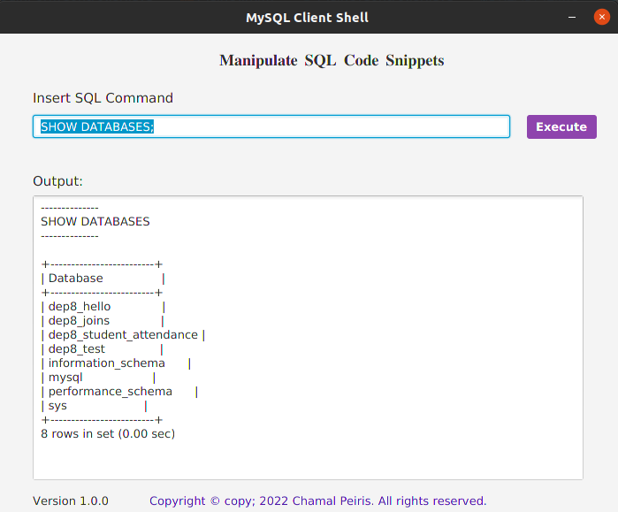

# MySQL Client Shell Application
**This is a Javafx application that will basically act as an IDE, which allows users to perform various SQL operations that are usually done via the terminal, with the aid of a more interactive user friendly GUI . further more, the application allows users to login to the SQL server via the GUI providing their credentials. To perform all these actions, the Java Process Builder class is used.**
### How to use this repo?

1. Clone the repository first  'git clone'

``https://github.com/Chamal-Peiris/simple-java-app-runner.git``

2. Once cloned, open the repository from any prefered IDE

3. Build and Run!

### Prerequisites
1.Use JDK 1.8
2.MySQL Server Should be installed

## User Login

## SQL Queries

## Usage

* This application can simply be used as an IDE to run SQL Queries.

### License

Version 1.0 , 12 March 2022

Copyright © copy; 2022 Chamal Peiris. All rights reserved.

Licensed under the [MIT](LICENSE) license

## Acknowledgements

* [Choose an Open Source License](https://choosealicense.com)